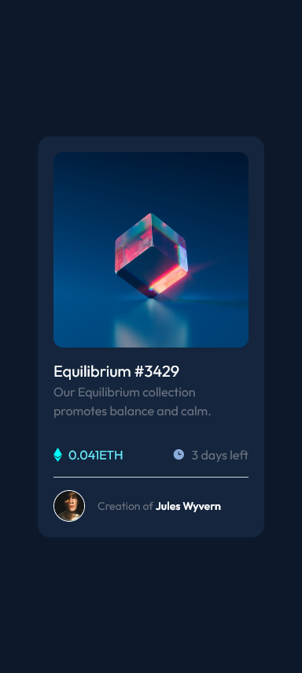

# Frontend Mentor - NFT preview card component solution

This is a solution to the [NFT preview card component challenge on Frontend Mentor](https://www.frontendmentor.io/challenges/nft-preview-card-component-SbdUL_w0U). Frontend Mentor challenges help you improve your coding skills by building realistic projects. 

## Table of contents

- [Overview](#overview)
  - [The challenge](#the-challenge)
  - [Screenshot](#screenshot)
  - [Links](#links)
- [My process](#my-process)
  - [Built with](#built-with)
  - [What I learned](#what-i-learned)
- [Author](#author)

## Overview

### The challenge

Users should be able to:

- View the optimal layout depending on their device's screen size
- See hover states for interactive elements

## Screenshot

### Wide screen screenshot

### Phone screen shreenshot

### Links

- [solution URL](https://www.frontendmentor.io/solutions/nft-preview-card-component-with-tailwind-fgqnmgqBH)
- [live site URL](https://gigagiorgadze.github.io/NFT-preview-card-component-challenge-hub/)

## My process

### Built with

- Semantic HTML5 markup
- Flexbox
- [Tailwind](https://tailwindcss.com/) - CSS framework

## Author

- Website - [GigaGiorgadze](https://gigagiorgadze.github.io/personal-portfolio/)
- Frontend Mentor - [@GigaGiorgadze](https://www.frontendmentor.io/profile/GigaGiorgadze)

